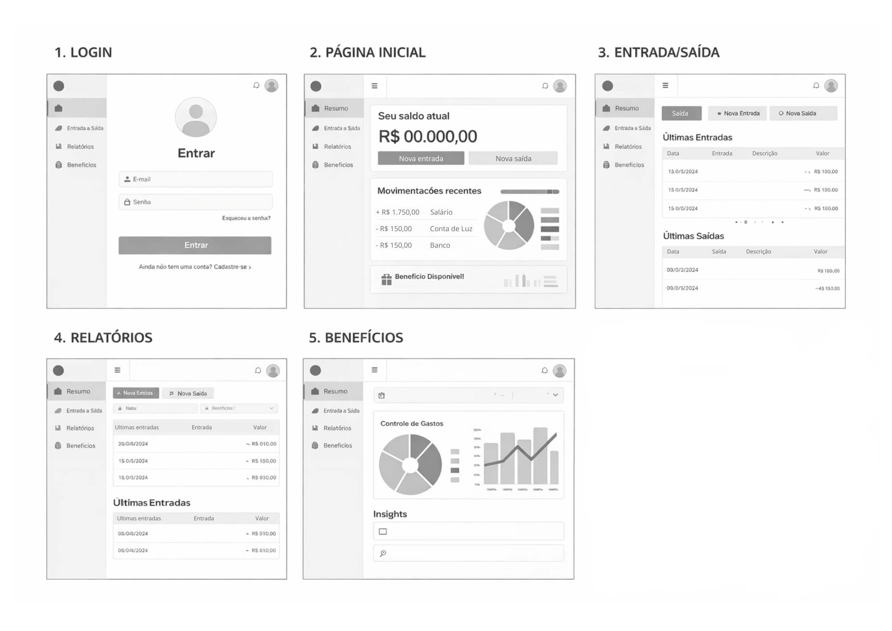
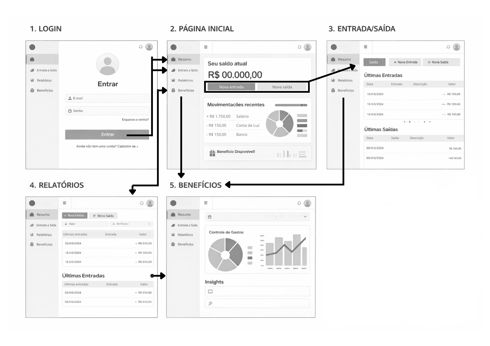
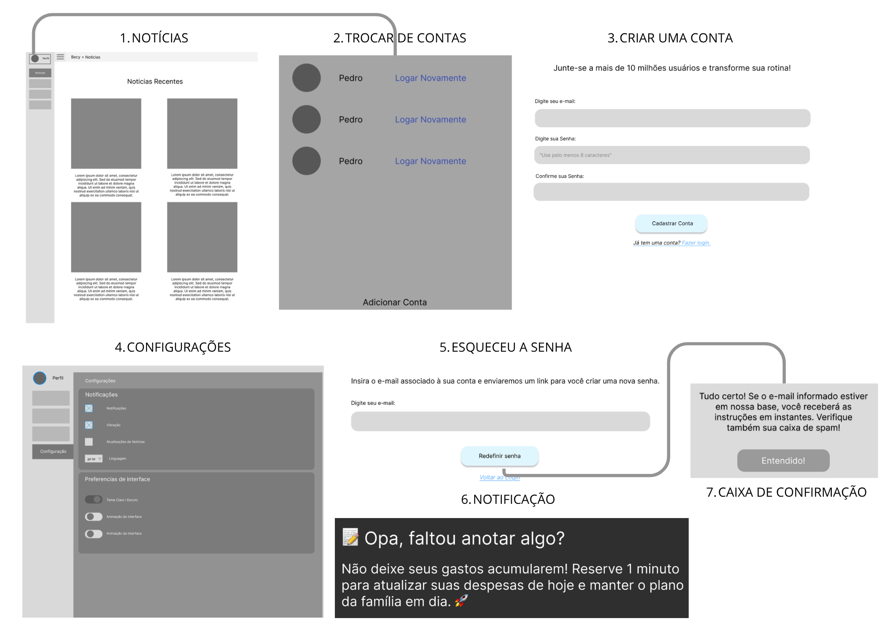

# Projeto de Interface

1. Autenticação e Acesso Seguros (Login, Cadastro e Recuperação)
Atendendo aos requisitos RF-001 e RF-002, estruturamos fluxos intuitivos de Login, Criação de Conta e "Esqueceu a Senha". As interfaces são limpas, contendo apenas os campos essenciais. A tela de recuperação inclui caixas de confirmação claras ("Tudo certo!"), reduzindo a ansiedade do usuário caso perca seu acesso.

2. Painel Principal (Dashboard) Sem Jargões
Projetado especialmente para personas como a Carla (A Resiliente), que precisam visualizar o orçamento de forma clara. A Página Inicial foca no essencial:

Acesso Rápido: Botões destacados em alto contraste para "Nova Entrada" e "Nova Saída", garantindo que o registro exija poucos cliques (RNF-005).

Visão Gráfica: Exibição do "Saldo Atual" e de um gráfico em formato de pizza com as movimentações recentes (RF-006), permitindo entender o fluxo de caixa sem a necessidade de jargões técnicos.

3. Gestão de Fluxo de Caixa e Relatórios
As telas de Entrada/Saída e Relatórios foram pensadas para usuários metódicos como a Beatriz e empreendedores como o Roberto (MEI). A interface utiliza listas organizadas por data, descrição e valor, facilitando a conferência diária e a futura geração de extratos (RF-015).

4. Múltiplos Perfis e Personalização (Contas e Configurações)
Troca de Contas: A tela "Trocar de Contas" atende diretamente ao RF-014, permitindo que o usuário alterne rapidamente entre um perfil "Pessoal", um perfil de "Empresa" ou uma "República", mantendo os saldos isolados.

Configurações: O usuário possui total controle para ativar ou desativar notificações, vibração e preferência de interface (Tema Claro/Escuro), respeitando as necessidades de conforto visual e acessibilidade (RNF-004).

5. Lembretes e Notificações Proativas
Para auxiliar personas como o Gustavo (O Desorganizado), a interface prevê Push Notifications amigáveis com textos como: "Opa, faltou anotar algo? Reserve 1 minuto...". Essa funcionalidade atende aos requisitos de alerta (RF-009) e atua como um reforço comportamental essencial para manter a "ofensiva" (streak) de uso do aplicativo.

6. Benefícios e Educação Financeira (Notícias)
As seções de Benefícios e Notícias foram incorporadas para entregar valor além da matemática financeira. Elas servem como espaço para exibir o controle de gastos avançado, dicas de educação financeira e, no futuro, a integração com mapas de ONGs e suporte social (RF-017).

## User Flow

Fluxo de usuário (User Flow) é uma técnica que permite ao desenvolvedor mapear todo fluxo de telas do site ou app.

## Wireframes

São protótipos usados em design de interface para sugerir a estrutura de um site web e seu relacionamentos entre suas páginas.

## Protótipo Interativo

O protótipo interativo de alta fidelidade (aplicação totalmente funcional executada diretamente no navegador) está disponível no seguinte link:

> [Acessar Protótipo Interativo (PlanejaLar no GitHub Pages)](https://icei-puc-minas-psg-ads-ti.github.io/psg-ads-2026-1-p1-tiawfe-244101-controlefinanceiro/src/index.html)
